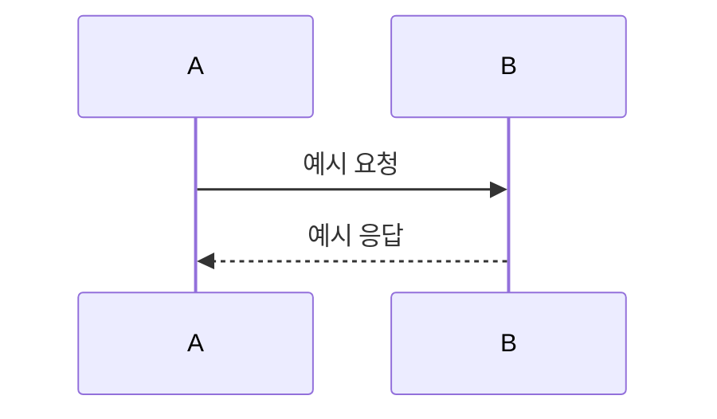

## 🧭 흐름 요약
- 이 흐름은 어떤 과정을 통해 어떤 결과로 이어지는가?

## 🔁 단계 요약 (리스트)
- 1단계:
- 2단계:
- 3단계:

## 📊 시각화 (Mermaid)

```mermaid
sequenceDiagram
participant A
participant B
A->>B: 예시 요청
B-->>A: 예시 응답
```
## **✨ 깨달음:**

- 흐름에서 얻은 구조적 통찰 또는 반복 패턴
## **🔗 관련 개념**

- [[관련 1]]