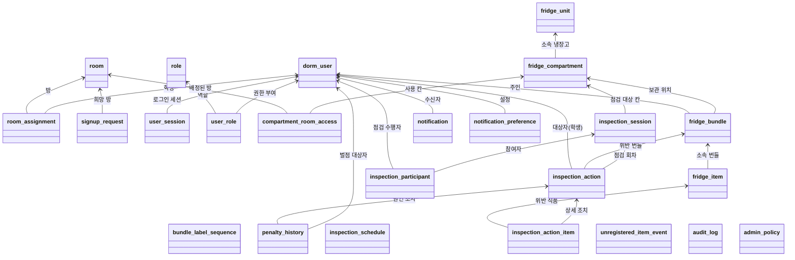

# 무제

## 📖 소스 요약 (Summary)

```mermaid
classDiagram
direction BT

%% --- 클래스 정의 (이름만 나열) ---
class admin_policy
class audit_log
class bundle_label_sequence
class compartment_room_access
class dorm_user
class flyway_schema_history
class fridge_bundle
class fridge_compartment
class fridge_item
class fridge_unit
class inspection_action
class inspection_action_item
class inspection_participant
class inspection_schedule
class inspection_session
class notification
class notification_dispatch_log
class notification_preference
class penalty_history
class role
class room
class room_assignment
class signup_request
class unregistered_item_event
class user_role
class user_session
class vw_fridge_bundle_owner_mismatch

%% --- 관계 정의 (의미 기반 설명으로 수정) ---

%% 1. 로그 및 감사
audit_log --> dorm_user : 행위자 (Actor)

%% 2. 냉장고 시설 구조
fridge_compartment --> fridge_unit : 소속 냉장고
bundle_label_sequence --> fridge_compartment : 라벨 시퀀스 관리
compartment_room_access --> fridge_compartment : 접근 권한 칸
compartment_room_access --> room : 권한 가진 호실

%% 3. 물품 보관 (핵심)
fridge_bundle --> dorm_user : 소유자 (Owner)
fridge_bundle --> fridge_compartment : 보관 위치
fridge_item --> fridge_bundle : 소속 번들

%% 4. 점검 프로세스
inspection_schedule --> fridge_compartment : 점검 대상 칸
inspection_schedule --> inspection_session : 연결된 세션
inspection_session --> fridge_compartment : 점검 대상 칸
inspection_session --> dorm_user : 시작한 관리자
inspection_session --> dorm_user : 제출한 관리자
inspection_participant --> inspection_session : 참여 세션
inspection_participant --> dorm_user : 참여 관리자

%% 5. 위반 조치 및 벌점
inspection_action --> inspection_session : 발생 세션
inspection_action --> fridge_bundle : 위반 번들
inspection_action --> dorm_user : 대상 학생
inspection_action --> dorm_user : 기록자
inspection_action_item --> inspection_action : 상위 조치
inspection_action_item --> fridge_item : 위반 식품
penalty_history --> dorm_user : 벌점 받은 학생
penalty_history --> dorm_user : 부과한 관리자
penalty_history --> inspection_action : 위반 근거

%% 6. 알림
notification --> dorm_user : 수신자
notification_dispatch_log --> notification : 발송 로그
notification_preference --> dorm_user : 설정 유저

%% 7. 회원 및 기숙사 관리
room_assignment --> dorm_user : 거주 학생
room_assignment --> room : 배정 호실
signup_request --> dorm_user : 검토자
signup_request --> room : 신청 호실
user_role --> dorm_user : 대상 유저
user_role --> dorm_user : 부여한 사람
user_role --> role : 부여된 권한
user_session --> dorm_user : 로그인 유저

%% 8. 기타 이벤트
unregistered_item_event --> dorm_user : 신고자
unregistered_item_event --> inspection_session : 발견 세션
unregistered_item_event --> room : 추정 호실
```
- 이 정보원의 핵심 내용이나 주제를 한두 문장으로 요약합니다.

```mermaid
classDiagram
direction BT

%% --- 1. 사용자 및 기숙사 ---
class dorm_user
class room
class room_assignment
class signup_request
class user_session
class user_role
class role

%% --- 2. 냉장고 시설 ---
class fridge_unit
class fridge_compartment
class compartment_room_access

%% --- 3. 보관 물품 (번들/아이템) ---
class fridge_bundle
class fridge_item
class bundle_label_sequence

%% --- 4. 점검 및 단속 ---
class inspection_session
class inspection_participant
class inspection_action
class inspection_action_item
class inspection_schedule
class penalty_history
class unregistered_item_event

%% --- 5. 알림 및 기타 ---
class notification
class notification_preference
class audit_log
class admin_policy

%% --- 관계선 (화살표) ---
%% 유저와 방
room_assignment --> dorm_user : 학생
room_assignment --> room : 방
signup_request --> room : 희망 방

%% 권한 및 세션
user_role --> dorm_user : 권한 부여
user_role --> role : 역할
user_session --> dorm_user : 로그인 세션

%% 냉장고 구조
fridge_compartment --> fridge_unit : 소속 냉장고
compartment_room_access --> fridge_compartment : 사용 칸
compartment_room_access --> room : 배정된 방

%% 물품 보관 (핵심)
fridge_bundle --> fridge_compartment : 보관 위치
fridge_bundle --> dorm_user : 주인
fridge_item --> fridge_bundle : 소속 번들

%% 점검 프로세스
inspection_session --> fridge_compartment : 점검 대상 칸
inspection_participant --> inspection_session : 참여자
inspection_participant --> dorm_user : 점검 수행자

%% 위반 조치
inspection_action --> inspection_session : 점검 회차
inspection_action --> fridge_bundle : 위반 번들
inspection_action --> dorm_user : 대상자(학생)
inspection_action_item --> inspection_action : 상세 조치
inspection_action_item --> fridge_item : 위반 식품

%% 벌점 및 알림
penalty_history --> dorm_user : 벌점 대상자
penalty_history --> inspection_action : 원인 조치
notification --> dorm_user : 수신자
notification_preference --> dorm_user : 설정
```
## 💭 생각의 인큐베이터 (My Thoughts & Connections)
