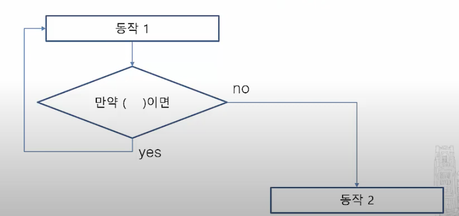

 - ## 순서도
	 - ### 작업의 진행 흐름을 기호와 도형을 이용해 순서대로 적어놓은것
	 - 도형의 의미
		 - 타원 : 시작과 끝
		 - 직사각형 : 일을 순서대로 진행
		 - 마름모 : 조건기호
			 - 조건을 확인하여 동작절차순서를 결정한다
		 - 육각형  
			변수 선언 및 초기값 부여, 
			배열 선언

- ## 변수
	- ### 데이터를 저장하는 물리적 장소의 이름
		- 컴퓨터는 데이터를 사용할려면 물리적 장소에 저장한후에야 저장가능 그 물리적 장소에 이름을 붙인것
	 - count <- 20 
	 - count = 20
	  
- ## 반복문
	- 평소처럼 자연스럽게 내려가는게 yes
	- 아닌게 no 
	- no이후의 동작은 오른쪽이아닌 아래다 모든 동작단계는 수직이다.
	- 