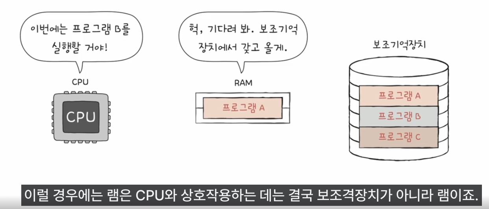
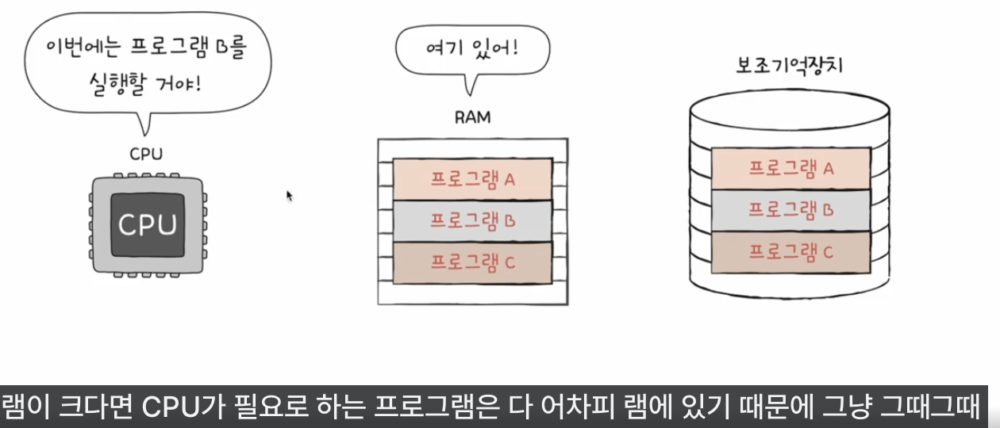

- 주기억장치(Main Memory의 한글화)의 종류
	- RAM
		- '메모리'라고 주로 지칭함
	- ROM

기억나니? cpu는 ram 즉 메모리 부터 명령어와 데이터들을 가져와 실행하고
램은 실행할 대상을 저장하고 그치만 전원이 꺼지면 내용 사라짐
그래서 전원이 꺼져도 내용 기억하는 대용량 보조기억장치 필요

즉 ram은 실행할 대상을 저장하고 보조기억장치는 보관할 대상을 저장한다.

### RAM이 크면 뭐가 좋을까
- RAM의 용량은 컴퓨터 성능에 어떤 영향을 미칠까
- 만약에 ram이 프로그램 하나만 저장가능 하다면??
	- 프로그램 A를 실행하고 싶을땐 
		- RAM이 보조기억장치의 프로그램 A를 복사해 저장
		- CPU가 RAM에 저장된 프로그램을 가져와 실행
	- 즉 새로운 프로그램을 실행할때마다 새롭게 보조기억장치로부터 램에 복사해 cpu로 가지고 와야함
	- 
	- 즉 cpu가 한번에 여러개의 프로그램을 동시해 실행하는 성능이 떨어지게 됨
- 극단적으로 RAM이 크다면?
	- 많은 프로그램들을 동시에 실행하는데 유리
	- 
- 비유하자면 
	- 책장에 있는 책들을 가져와 읽을때 책상이 클수록 유리하다
	- 책장이 크다면 책장에 왔다갔다하며 책을 가져올 필요가 없다
	- 보조메모리에 있는 프로그램들을 가져와 실행할때 RAM이 클수록 유리하다
### RAM의 종류와 차이
- **D**RAM (Dynamic RAM)
	- Dynamic 동적의(움직이는,변화하는)
		- 데이터를 전하로 저장함, 이 전하는 전원연결되어 있어도 시간이 지나면 누설됨
			- 커패시터에 전하가 있으면 비트 1 
			- 커페시터에 전하가 없으면 비트 0
		- 그래서 전하를 주기적으로 리프레시(**각 셀의 데이터를 읽고, 그 데이터를 다시 써서 전하를 보충**)해야 함
	- DRAM은 일반적으로 메모리에서 사용한다.
		- 상대적으로 소비전력이 낮고, 가격도 저렴하고 집접도가 높아서(뺵뺵하게 설계가능) 대용량으로 설계하기 편함
- **S**RAM (Static RAM)
	- Static 정적의
	- 플립플롭(flip-flop) 회로를 사용하여 데이터를 저장함, 전원연결이 된다면 누설안됨
		- 전원이 연결되지 않다면 데이터가 사라진다.
		-  플립플롭 회로에서 트랜지스터의 상태 변화로 1과 0을 나타냅니다. 
			- 전하의 흐름이 있으면 1, 없으면 0입니다.
	- SRAM은 일반적으로 캐시메모리에서 사용한다.
		- 대용량으로 설계할 필요가 없고 빠르게 동작해야하는 저장장치에 사용이 된다
			- DRAM보다 일반적으로 입출력이 더 빠르다
			- 소비전력이 높고,가격도 비싸고 집접도가 낮아서 대용량 설계가 힘들다
- **SD**RAM (Synchronous DRAM)
	- 클럭신호와 동기화된 DRAM
		-  S램이랑 관련 x
		-  특별한(발전된) DRAM
- **DDR SD**RAM (Double Data Rate SDRAM)
	- 대역폭을 넓혀 데이터 전송률을 2배로 늘린 DRAM
		- 특별한(발전한) SDRAM
		- 대역폭이란 데이터를 주고받을 수 있는 길의 너비
			- SDRAM은 클럭 신호 하나당 워드 한개 전송 (싱글 데이터 전송)
			- DDR SDRAM은 클럭 신호 하나당 워드 두개 전송 (더블 데이터 전송)
			- “데이터 한 개”는 일반적으로 시스템이 한 번에 처리할 수 있는 데이터의 기본 단위인 “워드(word)“를 의미합니다. 워드의 크기는 시스템 아키텍처에 따라 다르지만, 보통 8비트, 16비트, 32비트, 64비트 등이 있습니다
	- DDR4 SDRAM 최근 가장 대중적으로 메모리에서 사용한다
		- DDR2 SDRAM (DDR SDRAM의 2배)
			- DDR2 SDRAM은 클럭 신호 하나당 워드 4개 전송
		- DDR3 SDRAM (DDR2 SDRAM의 2배)
			- DDR3 SDRAM은 클럭 신호 하나당 워드 8개 전송
		- DDR4 SDRAM (DDR3 SDRAM의 2배)
			- DDR4 SDRAM은 클럭 신호 하나당 워드 16개 전송