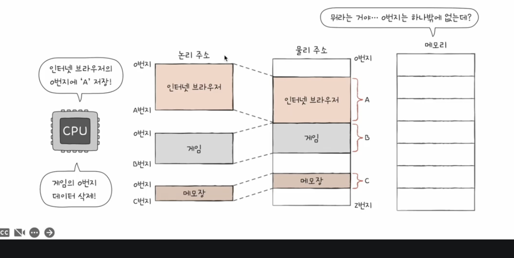

 
- 메모리에 저장된 값들은 시시각각 변한다
	- 새롭게 실행되는 프로그램은 보조기억장치로부터 새롭게 메모리에 적재
	- 실행이 끝난 프로그램은 메모리에서 삭제
	- 같은 프로그램을 실행하더라도 실행할때마다 적재되는 주소는 다름
- ### 그래서 cpu와 실행중인 프로그램은 메모리에 저장된 값을 알지 못한다
	- 그래서 cpu와 실행중인 프로그램들을 위한 주소가 필요하다

### 그래서 메모리 주소 체계는 크게 2가지가 있다 
- #### 논리주소
	- ##### cpu와 실행중인 프로그램들 입장에서 바라본 주소
	- 지금 실행 중인 프로그램 각각에게 부여되는 0번지부터 시작하는 주소다
		- 겹치는 주소번지가 있다
- #### 물리주소 
	- ##### 메모리 내 실제 하드웨어의 주소의 번지
		- ##### 메모리 입장에서 바라본 주소
	- 실제 하드웨어 주소이기에 0번지는 한개
		- 겹치는 주소가 없다

### cpu가 메모리와 상호작용하려면 논리주소를 물리주소로 변환해야한다.
- 
- #### MMU (메모리 관리 장치)가 논리주소를 물리주소로 변환시킨다.
	- MMU는 논리주소와 베이스 레지스터의 값을 더해 논리주소를 물리주소로 변환시킨다.
		- cpu공부할때 베이스 레지스터는 기준주소의 역할을 하는 레지스터라고 배움
			- 베이스 레지스터는 프로그램의 물리적 시작주소를 담는다.