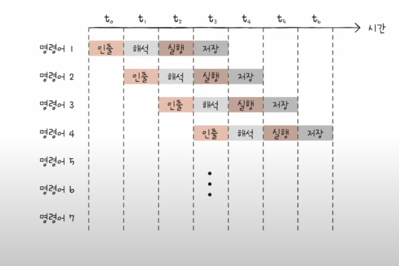
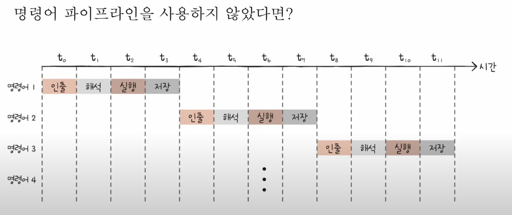
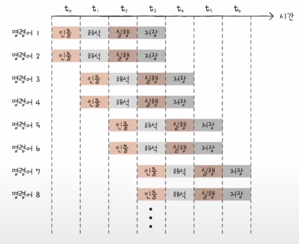
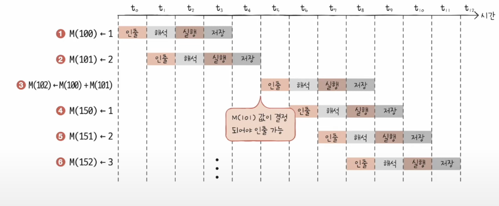
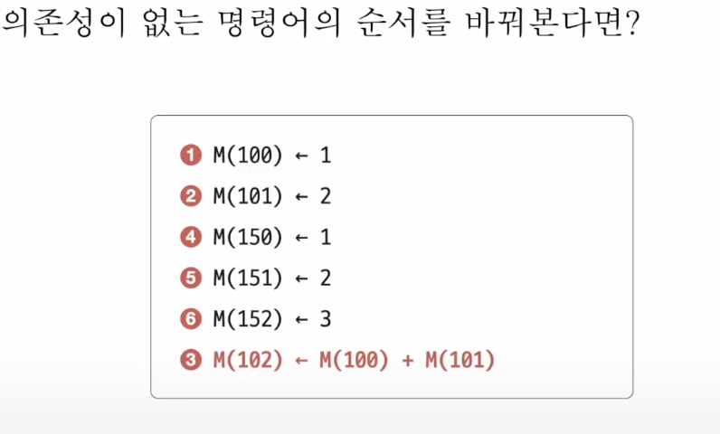
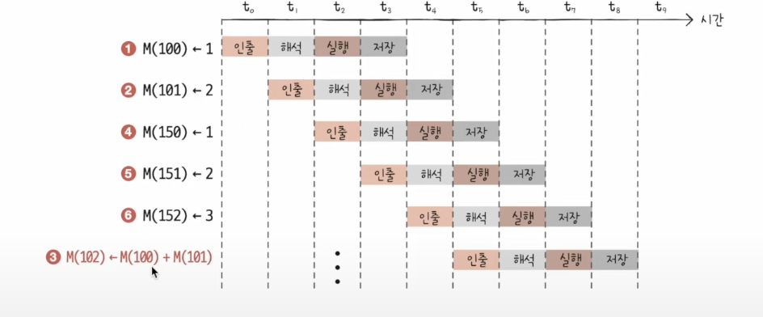

- 시간을 알뜰살뜰히 쓰며 명령어를 처리할 방법은?
1.  명령어 파이프 라인
	- 전공서에 따라 다르다.
	1) 명령어 인출
	2) 명령어 해석
	3) 명령어 실행
	4) 결과 저장
	- 같은 단계가 겹치지만 않는다면 cpu는 각단계를 동시에 실행할 수 있다.
		
		
		
	- 파이프라인 위험
	- 명령어 파이프라인이 성능 향상에 실패하는 경우(동시에 명령어를 처리할수없는경우)
		1) 데이터 위험
			- 명령어 간의 의존성때문에 생김
			- 모든 명령어를 동시에 처리할 수는 없다
			- 이전 명령어를 끝가지 실행해야만 비로소 실행할 수 있는 경우
				- 명령어 1: R1 <- R2 + R3 // 레지스터 합을 R1 레지스터에 저장
				- 명령어 2 :R4 <-R1+R5 // 레지스터 합을 R4 레지스터에 저장
		2) 제어 위험
			- 프로그램 카운터의 갑작스러운 변화
			- cpu가 실행하고자 하는 메모리의 주소번지가 다른 특정 번지로 바뀌는 경우
			- jump, interrupt....
			- 해석할때 11번지를 인출, 실행할때 11번지를 해석과 12번지를 인출, 근데 실행해 보니까 다음은 60번지를 실행해야할때 11,12 미리한게 헛수고
			- -> 이러한 상황을 방지하기 위해서 프로그램 카운터가 어디로 jump할것인지 예측하는 기술인 분기 예측이 있음
				
		3) 구조적 위험
			- 서로 다른 명령어가 같은 cpu 부품(ALU, 레지스터)을 쓰려고 할때
2. 슈퍼스칼라
	- cpu 내부에 여러개의 명령어 파이프라인을 포함한 구조
	- 오늘날의 멀티스레드 프로세서
		
	- 이론적으로는 파이프라인 개수에 비례하여 처리 속도가 증가
	- 하지만 파이프라인 위험도가 증가해서 실제로 처리속도가 비례해 증가하진 않음
3. 비순차적 명령어 처리(OOOE)
	- 파이프 라인의 중단을 방지하기 위한 명령어들간의 합법적인 새치기
	- 순차적으로 진행한다면? 
		
	- 의존성이 없는 명령어의 순서를 바꿔본다면?
		- 이때 전체 프로그램 실행 흐름에는 영향이 없어야 한다
			
			