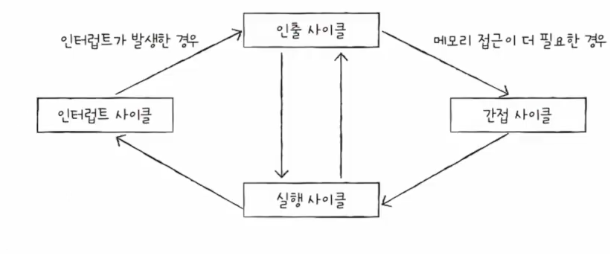

- ## **명령어 사이클(Instruction Cycle)**
	• **정의**: 명령어 사이클은 CPU가 하나의 명령어를 완전히 처리하는 데 필요한 전체 과정을 의미합니다.
	
	• **명령어 사이클 단계** : 
	- 챗선생왈 fetch-decode-execute-store
		1. Fetch(인출) 사이클 : 메모리에서 명령어를 가져옵니다.
			- CPU가 메모리로부터 명령어를 가져옵니다. 이때 명령어의 주소는 프로그램 카운터(Program Counter, PC)에 저장되어 있습니다.
			- 프로그램 카운터는 다음에 실행할 명령어의 주소를 가리킵니다. 인출이 완료되면 프로그램 카운터는 자동으로 다음 명령어의 주소로 증가합니다.
		2. **해석하기(Decode)**:
			- 인출된 명령어는 해독 단계에서 해독됩니다. 명령어 레지스터(Instruction Register, IR)에 저장된 명령어는 CPU의 제어 유닛(Control Unit)에 의해 해독됩니다.
			- 해독된 명령어는 CPU 내부에서 어떤 동작을 수행해야 하는지를 결정합니다.
		3. **실행하기(Execute)**: 명령어를 실행합니다.
			- 해독된 명령어에 따라 실제 연산이 수행됩니다. 연산은 산술 논리 연산(덧셈, 뺄셈, AND, OR 등), 데이터 이동, 메모리 접근 등이 있을 수 있습니다.
			- 연산 결과는 필요한 경우 레지스터나 메모리에 저장됩니다.
		4. **쓰기(Write-back)**
			-  실행된 명령어의 결과가 필요하다면, 이 결과를 레지스터나 메모리에 저장하는 단계입니다.
			- 이 단계는 모든 명령어에 필요한 것은 아니며, 특정 명령어에만 적용됩니다.
	- 정설인것 같은것(챗 say 이건 Instruction Cycle을 더 세부적으로 표현한 것임!)
		- cpu는 일반적으로 인출사이클 실행사이클을 반복하여 수행한다
			- 갖고오고-실행하고-갖고오고-실행하고
		- 그런데 인출하더라도 바로 실행이 불가능한 경우가 있다
			- 간접주소지정방식 때매 간접사이클도입
		- 그런데 인출-간접-실행 이 세가지 사이클을 끊는 사이클이 존재
			- 인터럽트 사이클
				- 인터럽트: 방해하다
				- 아무때나 끊는게 아니라 cpu가 꼭 주목해야할때/처리해야할때
1. **Fetch (인출)사이클**:
	-  CPU가 메모리에서 명령어를 가져오는 단계입니다. 이전 설명과 동일하게 프로그램 카운터(PC)에 저장된 주소를 사용하여 명령어를 인출합니다.
2. **Indirect (간접)사이클**:
	-  인출된 명령어가 간접 주소 지정 모드를 사용할 경우, 실제 데이터의 주소를 결정하기 위해 추가적인 메모리 접근이 필요합니다. 이 단계에서 주소를 해독하여 실제 데이터 위치를 찾습니다.
3. **Execute (실행)사이클**:
	- 해독된 명령어를 실제로 실행하는 단계입니다. 이 단계에서는 명령어의 종류에 따라 다양한 작업(산술 연산, 논리 연산, 데이터 이동 등)이 수행됩니다.
4. **Interrupt (인터럽트)사이클**:
	- 명령어 실행 중 또는 명령어 주기의 끝에서 인터럽트가 발생할 수 있습니다. 인터럽트는 CPU가 현재 작업을 중단하고, 우선 순위가 높은 작업을 처리하도록 합니다. 인터럽트를 처리한 후에는 원래 작업으로 돌아갑니다.

## 인터럽트
- 동기 인터럽트
	- 예외
		- cpu가 예기치못한 상황을 접했을때 발생
		- 예외적인 상황을 먼저 처리해야겠다
		- 디버깅할려고 인터럽트,0으로 나눈다,실행할수없는 명령어..
		- 종류
			- 폴트
			- 트랩
			- 중단
			- 소프트웨어 인터럽트
- 비동기 인터럽트
	- 주로 입출력 장치에 의해 발생
	- 다른 하드웨어가 보내주는 알림 같은 역할
	- 키보드입력, 마우스클릭
	- 종류
		- 하드웨어 인터럽트
			- cpu가 입출력 작업 도중에도 명령어를 처리하기 위해(효율을 위해) 사용
			- 입출력 장치는 cpu에 비해 느리다
			- 인터럽트가 없다면 cpu는 프린트를 확인하는 과정을 주기적으로 수행해야한다
			- 완료되면 알림이 오니 알림만 신경쓰고 할일 하면 효율적
			- 종류
				1. maskable interrupt
				2. non maskable interrupt
			- 처리순서
				1. 입출력장치는 cpu에 인터럽트 요청신호를 보낸다
					- 하드웨어가 cpu한테 지금 끼어들어도 되요?
					- 정상적인 실행흐름을 끊는거기 때문에 인터럽트신호를 보내야한다
				2.  cpu는 실행 사이클이 끝나고 명령어를 인출하기 전 항상 인터럽트 여부를 확인한다 
				3. 인터럽트 요청이 있다면 인터럽트 플래그를 확인한다
					- 인터럽트를 받아들일 수 있는지 여부는 인터럽트 플래그에 표기되기 때문
					- 인터럽트 플래그로 인터럽트를 막을 수 있다
						- 그러나 하드웨어 고장, 정전 등의 반드시 처리해야하는 인터럽트(non maskable interrupt)는 인터럽트 플래그로 막을 수 없다
				4. 지금까지의 작업을 백업한다
					- 인터럽트를 받아들일 수 있다면 백업한다.
						- 지금까지의 레지스터들에 담아둔 내용을 메모리의 스택영역에 백업을하고 인터럽트 서비스에 빈 레지스터를 사용한다
						- 그리고 메모리에서 인터럽트서비스 루틴을 cpu로 가져와서 실행
				5. cpu는 인터럽트 서비스 루틴을 실행한다
					- 인터럽트가 발생했을떄 해당 인터럽트를 어떻게 처리하기 위한 프로그램 
					- 프로그램이기에 메모리에 저장되어있다.
					- 주체에 따라 각기 다른 프로그램으로 구별되어있음.
					- ex) 키보드가 인터럽트 요청을 보내면 이렇게 행동
					- ex) 마우스가 인터럽트 요청을 보내면 이렇게 행동
						- 
					- 주체(키보드, 마우스..)가 많은데 cpu가 어떻게 구별? 인터럽트 벡터 참조해서
						- 인터럽트 벡터: 각각의 인터럽트를 구분하기 위한 정보
						- 백터는 주체마다 해당하는 인터럽트 프로그램의 시작주소를 가지고 있음 ->시작주소부터 cpu가 실행.
						- 메모리에 인터럽트 벡터들을 모아둔 테이블이 있음
							- **스칼라**: 단일 값 (예: int x = 5;)
							- **벡터**: 여러 값의 모음 (예: int[] arr = {1, 2, 3, 4, 5};)
						- 주체는 인터럽트 요청 신호+ 인터럽트 벡터를 데이터 버스통해 cpu로 보낸다.
				6.  4.에서 백업해둔 작업 복구하여 실행을 재개
					- 메모리의 스택영역에 있던 데이터를 다시 레지스터들로 복원한다.