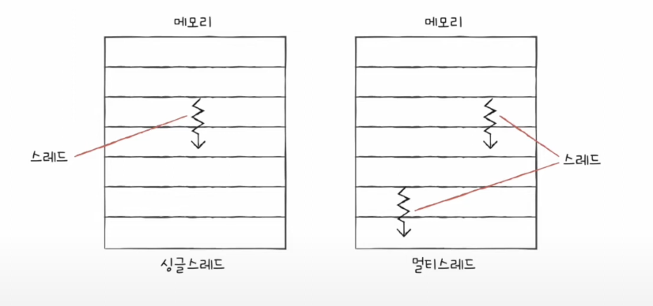
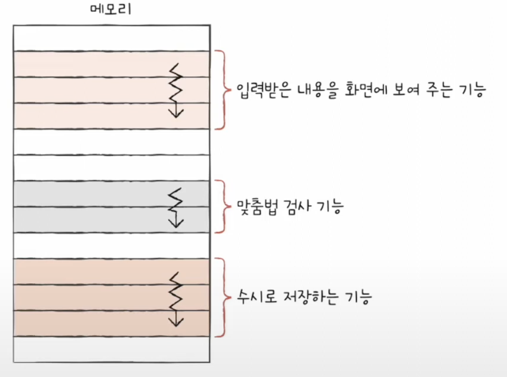

- ## cpu의 속도를 빨리 만드는 법
	1. 클럭 신호를 빠르게 만든다
		- 컴퓨터 부품들은 '클럭 신호'에 맞춰 움직인다.
		- cpu는 '명령어 사이클' 이라는 정해진 흐름에 맞춰 명령어들을 실행한다.
		- 클럭 신호를 빠르게 만들면 명령어 사이클도 빨라진다
		- 일반적으로 통하는 방법이다.
		- 클럭 속도
			- 1초에 반복되는 횟수를 헤르츠 단위(Hz)로 측정
			- 1초에 한번 반복되면 1Hz
			- 일반적으로 cpu는 25억Hz이다
			- cpu는 일정한 클럭 신호를 유지하는게 아니라 유도리있게 속도를 조절한다.
		- 그러나 필요 이상으로 클럭을 높이면 발열이 심각해짐
	2. 코어 수를 늘린다
		- 명령어를 실행하는 부품
			- 전통적 : CPU 하나 ->싱글코어 
			- 오늘날 : CPU 안에는 여러개 존재 그것이 바로 코어.
				
		- 그러나  속도는 코어 수에 비례하여 무조건 증가하지 않는다 (ex) 조별과제)
	3. 스레드 수를 늘린다
		- 스레드
			- 하드웨어적 스레드
				- 하나의 코어가 동시에 처리하는 명령어 단위
					- 하나의 코어가 한번에 하나의 명령어를 실행
						- -> 1 코어 1 스레드 cpu
					-  2개의 코어가 각각 2개씩 명령어를 실행할수있다
						- -> 2코어 4 스레드 cpu
						- 하나의 코어가 여러 명령어를 처리
							- ->멀티 스레드 프로세서, 멀티 스레드 cpu
						- 하이퍼 스레딩
							- 인텔의 멀티스레드기술 
					- 멀티 스레드 프로세서를 설계시 가장 큰 핵심은 레지스터.
						-
				- 논리 프로세서라고도 불린다..
					- 실제 프로세서의 개수는 아니지만 
			- 소프트웨어적 스레드
				- 하나의 프로그램에서 독립적으로 실행되는 단위
					
					- 싱글 스레드
						- 한 프로그램에서 하나의 실행 흐름이 순차적으로 실행된다
					- 멀티 스레드
						- 한 프로그램에서 동시에 두개 이상의 실행흐름이 순차적으로 실행된다.
			- ## 1코어 1스레드 cpu도 여러 소프트웨어적 스레드를 만들 수 있다.
	