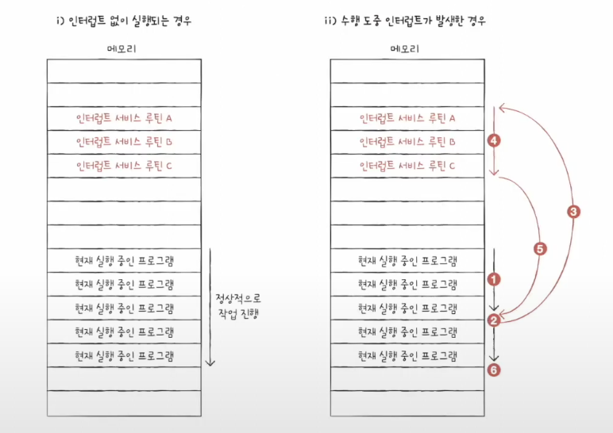

cpu가 메모리에 접근하는 속도< cpu의 연산속도
## 저장장치계층구조란?(Memory Hierarchy)
- 각기 다른 용량과 성능의 저장장치들을 cpu와 얼마나 가까운가를 기준으로 계층화하여 표현한 구조
	1.  cpu와 가까운 저장장치는 빠르고 멀리있는 저장장치는 느리다
	2.  속도가 빠른 저장 장치는 저장 용량이 작고, 가격이 비싸다
	
	- 각각의 저장장치들의 장단점이 명확해 하나의 저장장치만 쓸수는 없다
	- 그래서 일반적으로 컴퓨터에서는 이 모든 저장장치를 계층적으로(장단점에 맞게) 배치해 사용한다.

## 캐시메모리
- cpu와 메모리 사이에 위치한, 레지스터보다 용량이 크고 메모리보다 빠른 SRAM 기반의 저장 장치
- cpu의 연산 속도와 메모리 접근 속도의 차이를 조금이나마 줄이기 위해 탄생
	- "cpu가 매번 메모리에 왔다갔다하기엔 시간이 걸리니, 메모리에서 cpu가 사용할 일부데이터를 미리 캐시 메모리로 가져와쓰자"
