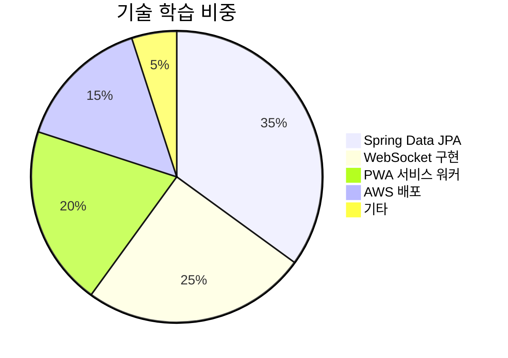

1. **Spring Boot API + DB 설계** (냉장고, 세탁기 등 도메인 중심)
2. **React 기본 프레임워크 세팅 + 로그인/마이페이지**
3. **NFC 연동 → 단순 URL 이동 구조**
4. **Service Worker 기반 푸시 알림 (VAPID)**
5. **관리자 페이지는 /admin 아래 경로로 완전히 분리해서 구현**

## **1순위 – MVP 필수 기능 (서비스 작동에 핵심)**

### **✅ 사용자 기능**

- 🔹 **로그인/회원가입 + 마이페이지 진입**
- 🔹 **세탁기 사용 인증 시스템**
    - 상태 기반 흐름 (사용 등록, 종료, 회수 대기, 무단 사용 등)
    - 시간 설정 및 기본 알림
    - 무단 사용 신고
- 🔹 **냉장고 보관 – 등록/수정/삭제 + 검사자 스캔 반응**
- 🔹 **푸시 알림 – 검사 예정일, 사용 종료, 회수 등 핵심 알림 3종**
- 🔹 **마이페이지 – 알림 센터 + 사용 내역 확인**
### **✅ 검사자 기능**
- 🔹 냉장고 검사일 등록, 검사자 스캔 시 검사일 업데이트
- 🔹 검사 기준 및 벌점 부여 UI (단, 관리자 수정은 제외)
    
---

## **✅** 
## **2순위 – 사용자 편의 기능 (MVP 포함 시 경험 향상)**

추가하면 매우 유용하지만 MVP 없이도 핵심 기능은 작동함.
- 🔸 냉장고 보관 – 메모 (본인만 보임)
- 🔸 냉장고 알림 설정 (유통기한 임박 3일 전 / 검사 하루 전)
- 🔸 세탁기 커스텀 시간 설정 (2개 고정)
- 🔸 세탁기 알림 세부 옵션 선택 (7분 전 알림 등)
- 🔸 “세탁물 빼놨어요” 1회 전송 및 상태 강제 전환 기능
- 🔸 무단 사용 시 신고자가 남은 시간 입력하는 기능

---
## **✅** 
## **3순위 – 확장 기능 (운영 안정화 후 도입)**

유용하거나 재미요소가 있지만 구현 복잡도나 정책 협의가 필요하거나, 없어도 사용자 불편이 적음.
- 🟡 **도서 대출 기능 전체** (단일 시스템으로 MVP 구축 후 병합)
- 🟡 **스터디룸 예약 시스템 전체**
- 🟡 **테니스장 예약 시스템 전체**
- 🟡 **책 찾기, 대출 기간 연장, 예약 기능**
- 🟡 **벌점/상점 자동부여 시스템 전체**
- 🟡 **기숙사 급식 크롤링 및 표시**
- 🟡 **외박 신청 페이지 리디렉션 버튼**

---

## **✅** 

## **4순위 – 관리자 전용 확장 기능**
- 🔹 통계 대시보드
- 🔹 벌점/상점 조회 및 수정
- 🔹 냉장고 검사날짜별 유저 정리
- 🔹 전체 공지 전송 기능
---


PostgreSQL 추천 상황
	•	복잡한 데이터 구조(냉장고, 세탁기, 예약 등 다양한 엔티티와 관계)
	•	트랜잭션의 신뢰성이 매우 중요한 경우
	•	JSON 등 다양한 데이터 타입을 활용할 계획이 있을 때
	•	장기적으로 확장성과 유지보수를 우선시할 때
	•	표준 SQL 및 고급 쿼리(CTE, 전문 검색 등)가 필요한 경우
	•	대용량 데이터를 다루거나, 데이터 분석/집계가 많을 때

|                         |                                      |                                                  |
| ----------------------- | ------------------------------------ | ------------------------------------------------ |
| **Frontend (웹)**        | **React + Vite + TypeScript**        | 빠르고 직관적인 UI 개발, PWA 구성 용이, 상태기반 인터페이스 구현에 최적     |
| **Mobile Optimization** | **PWA (Service Worker + Web Push)**  | 앱 설치 없이도 NFC 연동, 알림, 오프라인 캐시 가능                  |
| **Backend**             | **Spring Boot 3 (Java 17+)**         | 네가 하고 싶은 기술이며, 구조화된 REST API와 보안 구성에 강점          |
| **Database**            | **PostgreSQL**                       | JSON 필드도 지원하고 관계형으로 기능별 정교한 설계 가능                |
| **API 문서화**             | **SpringDoc (OpenAPI)**              | Swagger UI로 API 테스트 가능하게 문서 자동화                  |
| **알림**                  | **Web Push (VAPID 방식)**              | 푸시 토큰 관리 없이 클라이언트 알림 발송 가능 (Service Worker 사용)   |
| **배포**                  | **Render, Railway 또는 AWS Lightsail** | 학생 입장에서 비용 부담 적고 Spring Boot + PostgreSQL 배포에 적합 |
| **인증**                  | **Spring Security + 세션 기반 또는 JWT**   | 사용자 수 적고 보안이 중요하므로 세션 기반 우선 고려                   |
## **🚀 기술 스택 추천**  
### **백엔드 중심 + PWA 지원에 최적화된 구성**

---

### **📚 핵심 기술**  
| 분류       | 기술                  | 선택 이유 & 활용처                                                                 |
|------------|-----------------------|-----------------------------------------------------------------------------------|
| **백엔드** | Spring Boot 3.x       | REST API 개발 효율화, 취업 포트폴리오 강화                                        |
|            | Spring Data JPA       | 복잡한 도메인(세탁기 상태, 냉장고 검사) 관리 용이                                 |
|            | Spring Security       | 사용자/검사자/관리자 역할 분리 구현                                              |
| **DB**     | MySQL 8.0             | 무료 + 트랜잭션 처리 안정성 (예: 세탁기 동시 사용 충돌 방지)                     |
| **테스트** | JUnit 5 + Mockito     | 단위 테스트 필수 (혼자 개발 시 버그 최소화)                                      |

---

### **🔗 연동 기술**  
| 분류       | 기술                  | 세부 적용 전략                                                                   |
|------------|-----------------------|---------------------------------------------------------------------------------|
| **NFC/RFID**| Spring REST Docs     | 실제 장비 대신 **모의 API 개발** (예: `/api/simulate/nfc?tagId=123`)           |
| **알림**   | WebSocket(STOMP)     | 실시간 알림 구현 (예: 세탁기 완료 시 PWA 푸시)                                  |
| **PWA**    | Workbox + Manifest   | 오프라인 접근 가능한 알림 센터 구현                                             |
| **배포**   | AWS EC2 + S3         | 무료 티어 활용 배포 (졸업 후 포트폴리오 지속 운영 가능)                         |

---

### **⚙️ 보조 도구**  
```markdown
1. [ERD Cloud](https://erdcloud.com) : 복잡한 냉장고-세탁기-대출 관계 시각화  
2. [Spring Initializr](https://start.spring.io) : 프로젝트 구조 자동 생성  
3. [Postman](https://postman.com) : API 테스트 (검사자 벌점 부여 기능 검증)  
4. [GitHub Actions](https://github.com/features/actions) : CI/CD 자동화  
```

---

### **🧠 학습 전략**  
#### **단계별 우선순위**  


---

### **⚠️ 주의사항**  
1. **NFC 실제 연동은 후순위**  
   - MVP 단계에선 `/api/simulate/nfc`로 가짜 데이터 처리  
   - ex) `@PostMapping("/simulate/nfc")` → `return "product_123"`  

2. **PWA 필수 기능만 구현**  
   ```html
   <!-- manifest.json 예시 -->
   {
     "short_name": "기숙사앱",
     "icons": [{"src": "/icon-192.png", "type": "image/png", "sizes": "192x192"}],
     "start_url": "/",
     "display": "standalone"
   }
   ```

3. **트랜잭션 처리 필수**  
   ```java
   @Transactional // 세탁기 상태 변경 시 필수
   public void changeMachineState(Long machineId) {
       Machine machine = machineRepository.findById(machineId).orElseThrow();
       machine.updateState(); // 동시 사용 방지
   }
   ```

---

### **📌 구현 팁**  
1. **공통 모듈 분리**  
   - `NotificationSender` 클래스 생성 → 모든 알림 로직 집중화  
2. **Enum 활용**  
   ```java
   public enum MachineState {
       AVAILABLE, IN_USE, DONE, REPORTED // 세탁기 상태 관리
   }
   ```
3. **벌점 계산 쿼리**  
   ```java
   @Query("SELECT u FROM User u WHERE u.penaltyScore > :threshold")
   List<User> findUsersWithHighPenalty(@Param("threshold") int threshold);
   ```

이 스택으로 진행 시 **백엔드 집중 + 간단한 프론트엔드** 조합이 가능하며, 250명 사용자도 안정적으로 처리할 수 있습니다. PWA 구현에 필요한 최소한의 프론트엔드 코드만 작성하고, 대부분의 로직을 Spring Boot에 위임하는 전략을 권장합니다! 💻🔧

